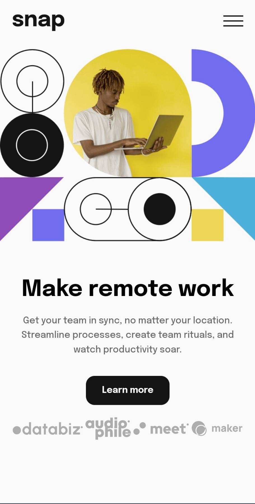
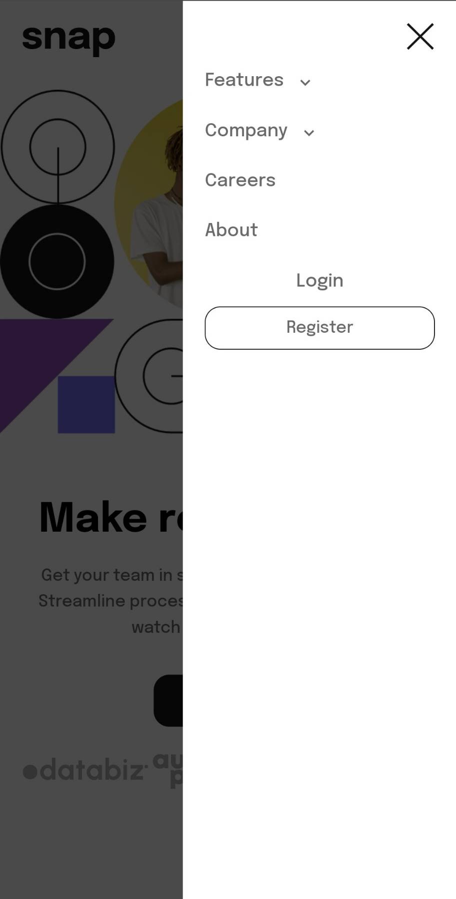

# Frontend Mentor - Intro section with dropdown navigation solution

This is a solution to the [Intro section with dropdown navigation challenge on Frontend Mentor](https://www.frontendmentor.io/challenges/intro-section-with-dropdown-navigation-ryaPetHE5). Frontend Mentor challenges help you improve your coding skills by building realistic projects. 

## Table of contents

- [Overview](#overview)
  - [The challenge](#the-challenge)
  - [Screenshot](#screenshot)
  - [Links](#links)
- [My process](#my-process)
  - [Built with](#built-with)
  - [What I learned](#what-i-learned)
- [Author](#author)

**Note: Delete this note and update the table of contents based on what sections you keep.**

## Overview

### The challenge

Users should be able to:

- View the relevant dropdown menus on desktop and mobile when interacting with the navigation links
- View the optimal layout for the content depending on their device's screen size
- See hover states for all interactive elements on the page

### Screenshot

desktop

active desktop

mobile

mobile menu

- Solution URL: [Github](https://github.com/stevanusfebrian/intro-with-dropdown-fm)
- Live Site URL: [Live Website](https://intro-dropdown-fm.netlify.app)

## My process

### Built with

- Semantic HTML5 markup
- CSS custom properties
- Flexbox
- Javascript

### What I learned

i learned how to use flexbox for my navbar and aligning flexbox items for main section. although, there is a little flexbox problem appearing in mozilla.

and I also learned some basic DOM javascript for dropdown menu

## Author

- Stevanus Febrian
- Frontend Mentor - [@yourusername](https://www.frontendmentor.io/profile/yourusername)
